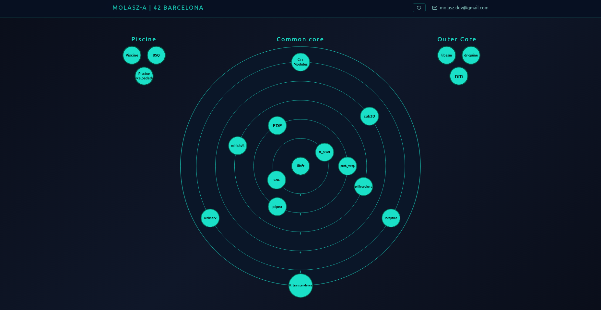

# 42 Barcelona — molasz-a

An interactive mind map of my journey through the [42 Barcelona](https://42barcelona.com) curriculum.

**[→ Interactive Project Map ←](https://molasz.github.io/42-graph/)**

## Why a graph?

The 42 curriculum isn't linear. Projects unlock each other, concepts build on previous ones, and the path you take is partly your own. A traditional list felt like it missed the point — a graph makes the structure visible: dependencies, progression rings, and the satellites (Piscine, Outer Core, Work Experience) that orbit the main common core.

The goal was something I'd actually want to look at, not just a bullet list on a CV.

## What's in it

- **Piscine** — the 4-week entry bootcamp
- **Common Core** — main curriculum, levels 0–6, arranged in concentric rings
- **Outer Core** — optional deep-dive projects (assembly, ELF parsing, quines)
- **Work Experience** — real-world context alongside the academic path

Each node links to its GitHub repo and shows a tooltip with a short description.

## Tech

Vanilla JS + SVG. No frameworks, no build step — just `index.html`.

- Pan and zoom the graph with mouse drag / scroll wheel
- Hover any node or title for details
- Replay the intro animation with the ↺ button
