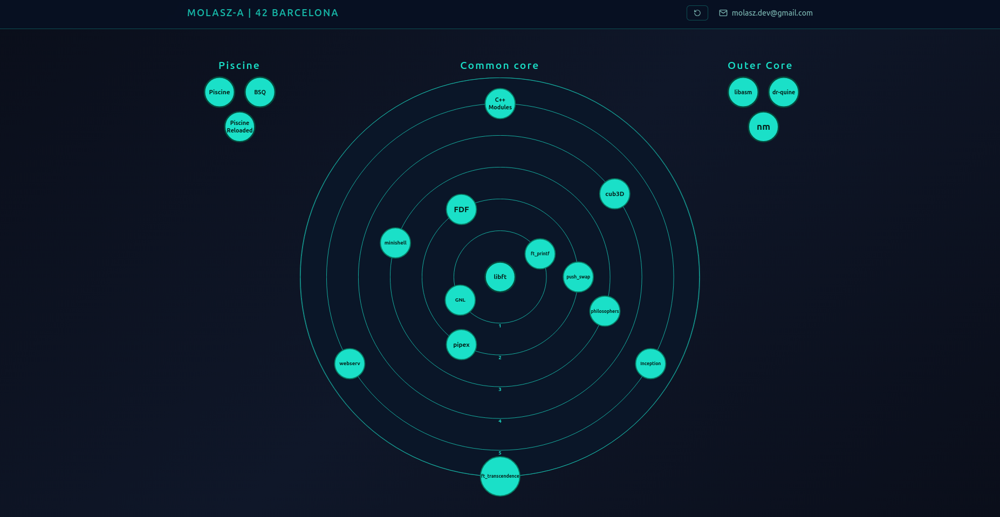

# 42 Barcelona Solar System — molasz-a

An interactive 3D Solar System visualization of my journey through the [42 Barcelona](https://42barcelona.com) curriculum, built with React, @react-three/fiber, and Vite.

<div align="center">

<a href="https://molasz.github.io/42-graph/" target="_blank">
  
</a>

**[→ Launch Interactive 3D Solar System ←](https://molasz.github.io/42-graph/)**

</div>

## Features

- **3D Solar System Architecture**: The 42 Core sun at the center with concentric planetary orbits for Common Core (Ranks 0 to 6), Piscine bootcamp, Outer projects, and Work Experience.
- **Interactive Celestial Spheres**: Every project is rendered as an interactive 3D sphere with procedural textures, atmospheres, planetary rings, and floating badges.
- **Constellation Dependency Beams**: Dynamic energy lines connecting prerequisites and curriculum pathways in real-time 3D space.
- **Cinematic Orbit Camera**: OrbitControls, smooth focus zoom on planets, custom camera angles (Core view, Outer belt, Top-down map).
- **Search & Filter System**: Real-time filtering by tech stack (C, C++, Docker, Web, etc.) and curriculum groups.
- **Glassmorphic Project Drawer**: Rich project overviews, skill tags, prerequisite links, and direct GitHub / PDF links.

## Tech Stack

- **React 19** & **@react-three/fiber** (Declarative Three.js in React)
- **@react-three/drei** (Camera controls, 3D HTML overlays, shaders)
- **Three.js** (WebGL 3D rendering, shaders, procedural textures)
- **Vite** (Modern fast bundler & build tool)
- **Lucide Icons & CSS Glassmorphism**

## Development & Build

```bash
# Install dependencies
npm install

# Start development server
npm run dev

# Build for production
npm run build

# Preview production build
npm run preview
```

## Make it your own

1. **Fork the repository** to your GitHub account.
2. **Update project data**: Edit `src/data/projectsData.js` to add your projects, tags, descriptions, and repository links.
3. **Update personal assets**: Replace `public/assets/CV.pdf` with your own CV.
4. **Deploy**: Build with `npm run build` and deploy the `dist/` directory to GitHub Pages or your favorite host.
